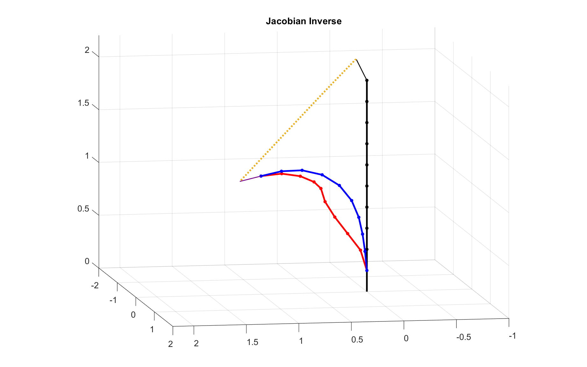

# Numerical-Inverse-Kinematics-General
 Robot Inverse Kinematics for General Robot

Robot Model: 10 Joint, each joint have 3 DOF

Use Traditional approach (SE3) and Lie algebra approach (se3).

Formular and Detail can be found in <u>demo_ikine_SE3.mlx</u> and <u>demo_ikine_se3.mlx</u>

If set step size small enough,

SE3 will cause a straight line trajectory:

se3 will cause a screw motion:

